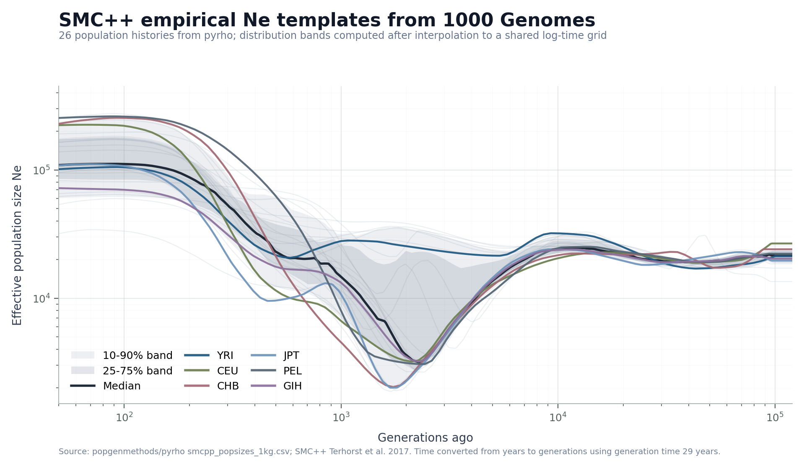
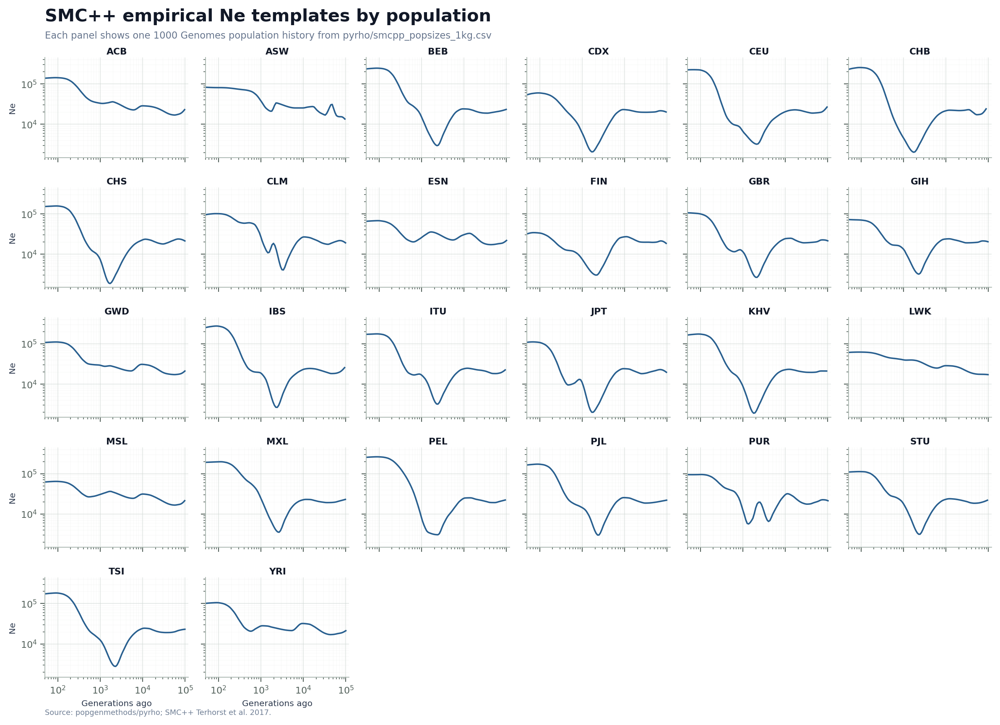
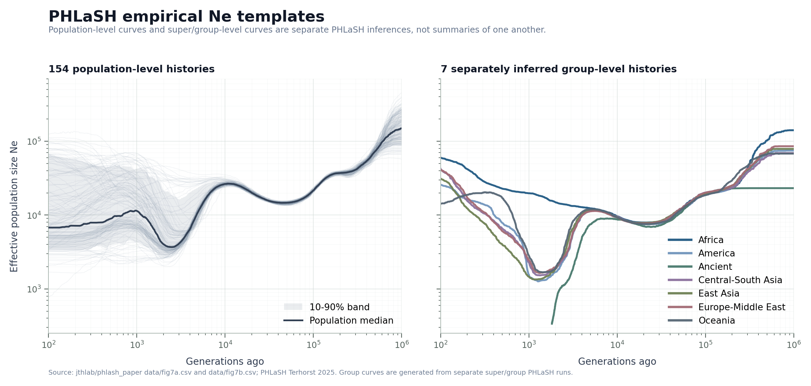
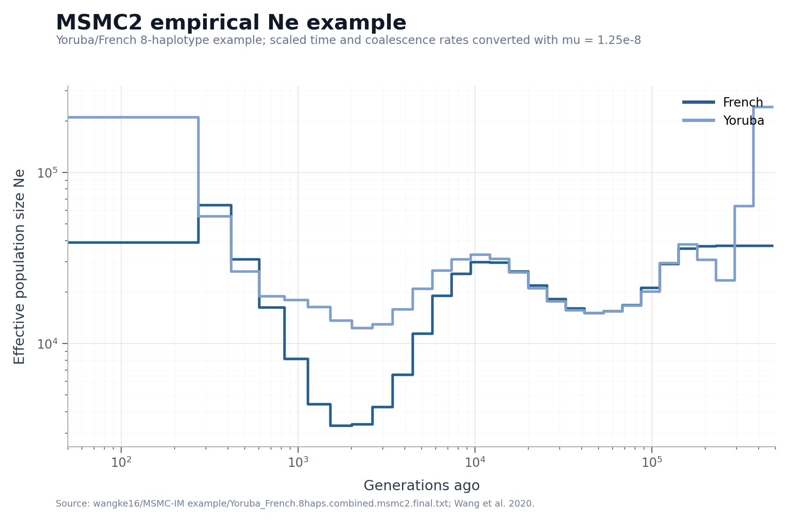

# Empirical Human Ne Templates

This directory contains empirical human effective-population-size templates used
by the `empirical_human_ne_template` demography sampler.

These curves are inference-derived templates, not simulation ground truth. The
simulator samples one template, interpolates it onto the configured logarithmic
time bins, and applies small random perturbations before building a
piecewise-constant `msprime` demography. Samples generated from these templates
are labeled with:

- `demography_type = "empirical_human_ne_template"`
- `target_quality = "empirical_inference_template_perturbed"`
- `template_source_key`
- `template_method`
- `template_population`

## Files Used Directly By The Simulator

| File | Source key | Method | Curves | Time unit used by simulator |
| --- | --- | --- | ---: | --- |
| `smcpp_popsizes_1kg.csv` | `smcpp_1kg` | SMC++ | 26 | original `x` is years; loader converts to generations with `/ 29` |
| `phlash_unified_populations_normalized.csv` | `phlash_unified` | PHLaSH | 154 | generations ago |
| `phlash_superpopulations_normalized.csv` | `phlash_super` | PHLaSH | 7 | generations ago |
| `msmc2_yoruba_french_within_ne_normalized.csv` | `msmc2_example` | MSMC2 | 2 | generations ago |
| `msmc_im_yoruba_french_ne_normalized.csv` | `msmc_im_example` | MSMC-IM | 2 | generations ago |

All normalized files use:

```text
population,generations_ago,Ne
```

## Provenance Files

These raw/source-format files are kept for auditability and regeneration:

| File | Description |
| --- | --- |
| `phlash_fig7a_unified_populations.csv` | PHLaSH paper figure 7a population-level curves |
| `phlash_fig7b_superpopulations.csv` | PHLaSH paper figure 7b separately inferred superpopulation/group curves |
| `msmc2_yoruba_french_8haps_combined.final.txt` | MSMC2 combined Yoruba/French example output |
| `msmc_im_yoruba_french_8haps_estimates.txt` | MSMC-IM Yoruba/French example estimates |

## Figures

The directory also includes compact previews of the empirical templates:

| Figure | Contents |
| --- | --- |
| `figures/smcpp_1kg_templates.png` | SMC++ 1000 Genomes population-history distribution bands and representative curves |
| `figures/smcpp_1kg_templates_by_population.png` | SMC++ 1000 Genomes population histories as small multiples |
| `figures/phlash_templates.png` | 154 PHLaSH population histories and 7 separately inferred group-level histories |
| `figures/msmc2_yoruba_french_templates.png` | MSMC2 Yoruba/French within-population histories |









## Data Sources

- SMC++ 1000 Genomes population-size estimates:
  [`popgenmethods/pyrho`](https://github.com/popgenmethods/pyrho),
  file `smcpp_popsizes_1kg.csv`.
- PHLaSH empirical curves:
  [`jthlab/phlash_paper`](https://github.com/jthlab/phlash_paper),
  files `data/fig7a.csv` and `data/fig7b.csv`.
- MSMC2 / MSMC-IM Yoruba-French example:
  [`wangke16/MSMC-IM`](https://github.com/wangke16/MSMC-IM),
  files under `example/`.

## References

- Terhorst, J., Kamm, J. A., and Song, Y. S. (2017). Robust and scalable
  inference of population history from hundreds of unphased whole genomes.
  *Nature Genetics*, 49, 303-309. https://doi.org/10.1038/ng.3748
- Kamm, J. A., Spence, J. P., Chan, J., and Song, Y. S. (2016). Two-locus
  likelihoods under variable population size and fine-scale recombination rate
  estimation. *Genetics*, 203(3), 1381-1399.
  https://doi.org/10.1534/genetics.115.184820
- Terhorst, J. (2025). Accelerated Bayesian inference of population size
  history from recombining sequence data. *Nature Genetics*, 57, 2570-2577.
  https://doi.org/10.1038/s41588-025-02323-x
- Wang, K., Mathieson, I., O'Connell, J., and Schiffels, S. (2020). Tracking
  human population structure through time from whole genome sequences.
  *PLOS Genetics*, 16(3), e1008552.
  https://doi.org/10.1371/journal.pgen.1008552

## Transformations

SMC++:

- The `pyrho` CSV stores `label`, `x`, and `y`.
- `label` is the 1000 Genomes population code.
- `y` is Ne.
- `x` is treated as years and converted by `generations_ago = x / 29`.

PHLaSH:

- The PHLaSH paper CSVs store `pop`, `years`, and `Ne`.
- In the paper workflow, these CSVs are generated from a grid named `T` in
  generations. The normalized files therefore store this column as
  `generations_ago`.
- `fig7a` population labels such as
  `unified/Yoruba/phlash/estimates.pkl` are normalized to `Yoruba`.
- `fig7b` group-level curves are separate PHLaSH inferences from
  `unified/super/{group}/phlash/estimates.pkl`; they are not averages or
  medians of the `fig7a` population-level curves.

MSMC2:

- The MSMC2 example stores scaled time and scaled coalescence rates.
- The normalized file uses `mu = 1.25e-8`.
- Time is converted with `generations_ago = left_time_boundary / mu`.
- Within-population Ne is converted with `Ne = 1 / (2 * lambda * mu)`.

MSMC-IM:

- The MSMC-IM example estimates already report time boundaries in generations.
- The normalized file keeps `im_N1` and `im_N2` as separate template curves.

## Runtime Configuration

The default simulator config points here:

```text
empirical_ne_template_dir = "data/templates/human_ne"
```

The default source mixture is:

```text
smcpp_1kg:0.25,phlash_unified:0.60,phlash_super:0.10,msmc2_example:0.04,msmc_im_example:0.01
```

If this directory is missing, the sampler automatically skips
`empirical_human_ne_template` rather than failing.
